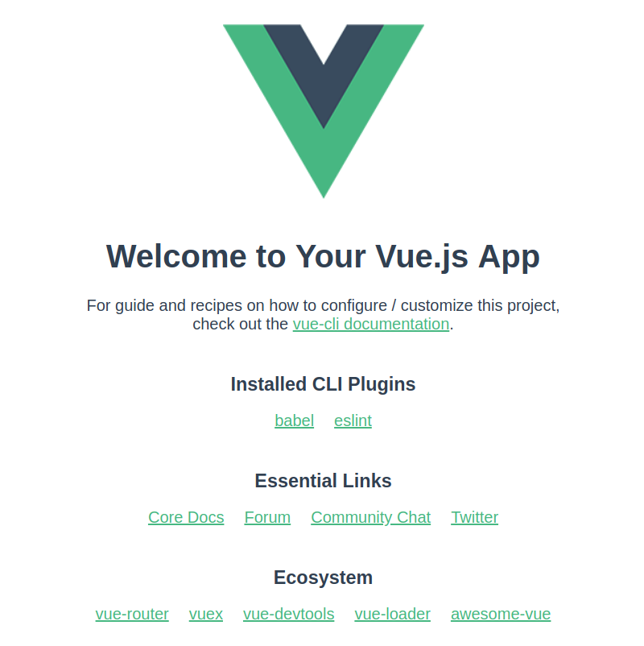

Welcome to this tutorial, I'm happy you made it here. This will be a tutorial on how to fetch and display gifs with Vue, retrieved from the giphy API. We will cover the following parts:

1.  Setting up with Vue-cli
1.  Taking input from the user
1.  Fetching data from the giphy API
1.  Building and displaying gifs
1.  Deploying to Netlify
1.  Conclusion & what's next?

Fair warning - the hardest part of this project is not getting distracted by hilarious gifs when testing your app

The guide is aimed at beginners with Vue and/or JavaScript, who wants to up their skills by building a "real-world" application and actually putting it online for other people to see. We will cover setting up your Vue project using the Vue-cli, registering user input and use it to request gifs from the giphy API, displaying these gifs on the page, and finally how to put your app online using Netlify (which is awesome and super simple!). I am by no means a Vue expert, but building this project taught me a lot of useful skills and I hope you will feel the same. Plus, it's fun!

### 1. Setting up with Vue-cli

We will be using the Vue-cli 3 beta, so if you have not already installed it, go ahead and grab it with npm by running this in your terminal:

```
npm install -g @vue/cli
```

NB: if you receive an error about permissions, run the command again but with "sudo" in front.

Next, we'll use it to set up our project. Run

```
vue create gif-searcher
```

in your terminal. This will prompt you to use the default or choose your features manually. For the purpose of this tutorial, the defaults are fine. Hit enter, and the CLI will set up your project for you (this might take a while). When it is done, you can write

```
cd gif-searcher && npm run serve
```

to enter your newly created project, and run the Vue development server. Visting http://localhost:8080/ (or whatever it says in your terminal) shows your brand new Vue project running, completely set up with hot reloading and sensible configurations. Hooray! If you run into issues or have any questions, feel more than welcome to write a question below and we'll sort it out.



### 2. Taking input from the user

So far, we just got the boilerplate Vue project running. For the sake of simplicity, we will be writing all our code within App.vue, so feel free to delete the components folder and strip the App.vue file down so it looks like this:
